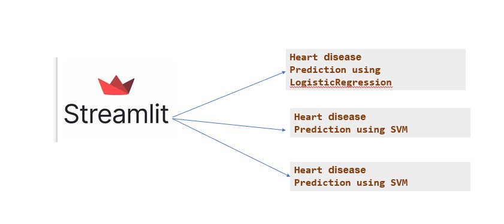

## Preferred IDE: Pycharm



### Test the streamlit app on local:

1. Install required dependencies on local:

```commandline
pip install -r requirements.txt
```


2. Test the streamlit app on local:

```
streamlit run app.py
```


### Building the docker image

(Note: Run as administrator on Windows and remove "sudo" in commands)

3. Important - Make sure you have installed Docker on your PC:
- Linux: Docker
- Windows/Mac: Docker Desktop

4. Start Docker:
- Linux (Home Directory):
  ```
  sudo systemctl start docker
  ```
- Windows: You can start Docker engine from Docker Desktop.

5. Build Docker image from the project directory:

```commandline
sudo docker build -t Image_name:tag .
```

### (Note: Rerun the Docker build command if you want to make any changes to the code files and redeploy.)

### Running the container & removing it

6. witch to Home Directory:

```
cd ~
```
List the built Docker images
```
$ sudo docker images
```

7. Start a container:
```commandline
sudo docker run -p 80:80 Image_ID
```

8. This will display the URL to access the Streamlit app (http://0.0.0.0:80). Note that this URL may not work on Windows. For Windows, go to http://localhost/.

9. In a different terminal window, you can check the running containers with:
```
sudo docker ps
```

10. Stop the container:
 - Use `ctrl + c` or stop it from Docker Desktop.

11. Check all containers:
 ```
 sudo docker ps -a
 ```

12. Delete the container if you are not going to run this again:
 ```
 sudo docker container prune
 ```

### Pushing the docker image to Docker Hub

13. Sign up on Docker Hub.

14. Create a repository on Docker Hub.

15. Log in to Docker Hub from the terminal. You can log in with your password or access token.
```
sudo docker login
```

17. Tag your local Docker image to the Docker Hub repository:
 ```
 sudo docker tag Image_ID username/repo-name:tag
 ```

17. Push the local Docker image to the Docker Hub repository:
 ```
 sudo docker push username/repo-name:tag
 ```

(If you want to delete the image, you can delete the repository in Docker Hub and force delete it locally.)

18. Command to force delete an image (but don't do this yet):
 ```
 $ sudo docker rmi -f IMAGE_ID
 ```
